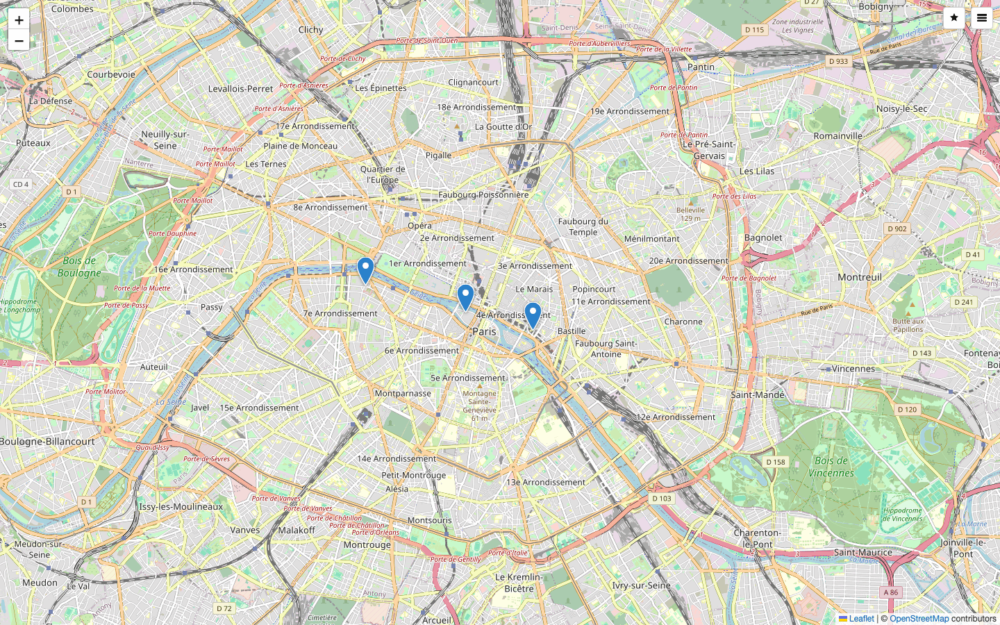
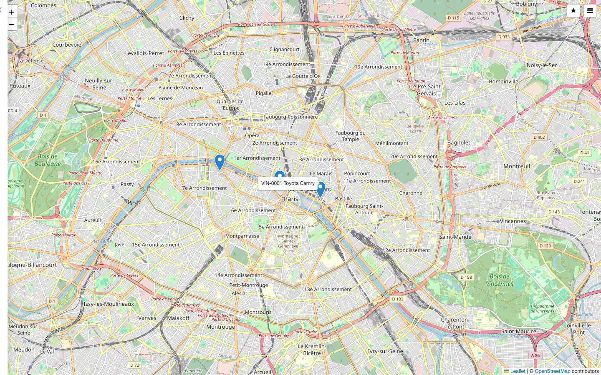
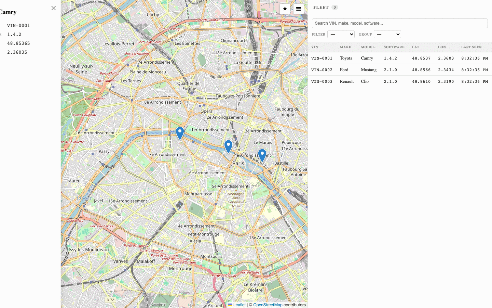
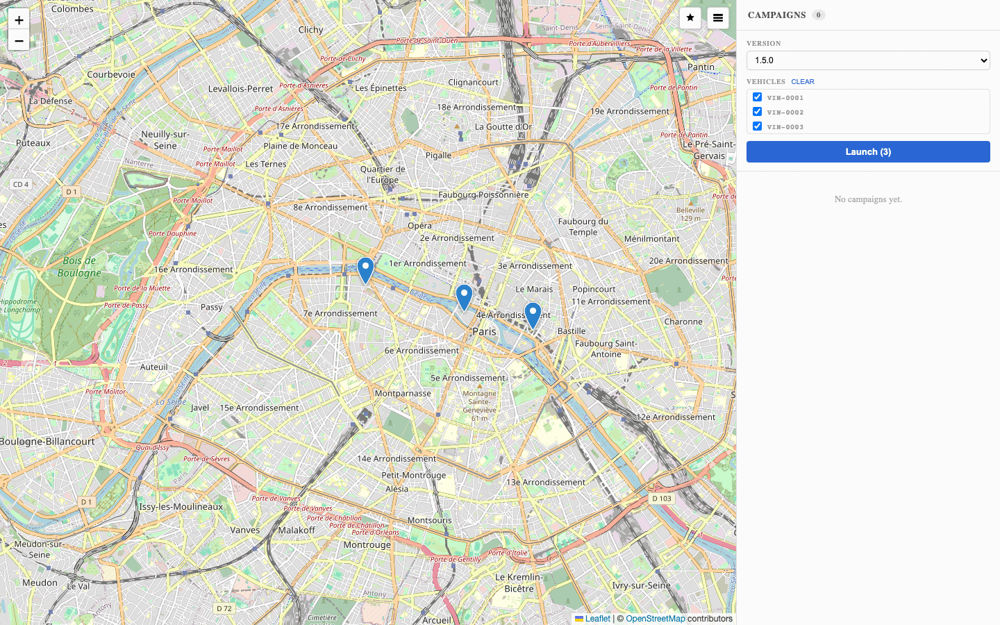
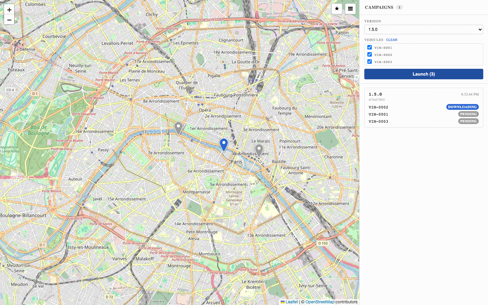
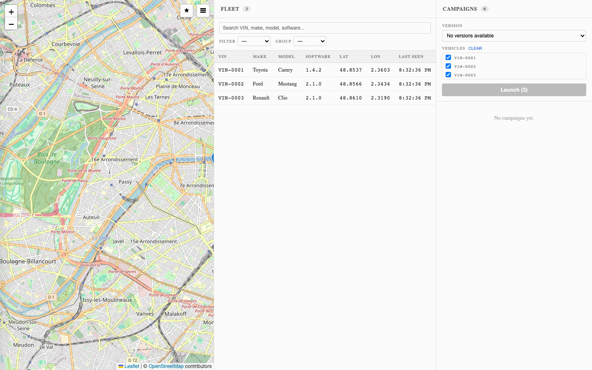

# Demo Guide

A step-by-step reference for running the SDV Fleet Management demo live.

---

## Before the demo

If you have not cloned and configured the repository yet, follow the
[Quickstart](README.md#quickstart) first.

Run these steps a few minutes before you present.

**1. Pre-pull the images, to avoid slow downloads during startup:**
```sh
docker compose pull
```

**2. To show the FAILED path, enable simulated failures.**

Failures are off by default, so a normal run is deterministic. Set this in `.env`:
```sh
OTA_FAILURE_RATE=0.2
```

**3. Start the full stack:**
```sh
docker compose up --build
```

**4. Wait for hawkBit.** First boot takes 60 to 120 seconds. Watch for this log line:
```
hawkbit-1 | ... org.eclipse.hawkbit.app.Start : Started Start in 77.207 seconds
```

**5. Check that the stack is up:**
```sh
curl -s -o /dev/null -w '%{http_code}\n' http://localhost:3000/health   # 200
open http://localhost:8090                                             # operator UI
```

Keep the browser tab open before you start the walkthrough.

---

## Full walkthrough recording

A complete run through of every feature: the live map, the vehicle drawer, the fleet table, an OTA
campaign launch, and real-time state updates.

The file is [`docs/screenshots/demo.mp4`](docs/screenshots/demo.mp4). It is stored with git-lfs. If
you cloned without git-lfs installed, run `git lfs pull` to fetch it.

---

## Demo walkthrough

### 1. Live fleet map

Open `http://localhost:8090`.

Three vehicle pins move across Paris, each updating about once per second.



Pin color follows the OTA campaign state of the vehicle, not its software version:

| Color | State |
|---|---|
| Blue | In no campaign |
| Grey | Pending |
| Dark blue | Downloading |
| Orange | Installing |
| Green | Complete |
| Red | Failed |

Positions travel a full round trip. A CSV Provider replays a recording into each vehicle
Databroker. The FMS Forwarder publishes `VehicleStatus` over uProtocol. The FMS Consumer writes it
to InfluxDB. FMS Server serves it as the rFMS API. The backend polls that API and pushes each
change to the browser over a WebSocket.

The backend reads the rFMS API rather than the database. A dashboard that speaks rFMS works against
any backend that implements the specification, and the telemetry owner hands out no database
credentials.

---

### 2. Vehicle detail drawer

Click any pin. The detail drawer opens on the left.

It shows the VIN, brand, model, current software version, live coordinates, and the OTA status
chip.



The drawer needs no extra request. `GET /fleet` loads the static fields once on page load, and
positions arrive over the `/ws/fleet` WebSocket. The status chip follows the latest campaign state
for that vehicle.

Brand and model come from `seed/vehicles.json`, not from rFMS. The blueprint `/rfms/vehicles`
endpoint returns the VIN and nothing else. See [`docs/rfms-coverage.md`](docs/rfms-coverage.md).

---

### 3. Fleet table

Click the Fleet icon in the toolbar. The table lists all three vehicles with VIN, brand, model,
software version, coordinates, and the last-seen time.



Demonstrate these controls:

- Search by VIN, brand, model, or software version.
- Filter by a field value.
- Group rows by a field.
- Reset, which clears every filter at once.

Filtering also hides the matching map pins. Both views stay in sync.

---

### 4. Launching an OTA campaign

Click the Campaign icon in the toolbar.

1. Select a target software version. The list comes from `GET /versions`, which reads the hawkBit
   distribution sets.
2. Check the vehicles to include, or leave all three selected.
3. Click **Launch**.



The backend creates a hawkBit rollout and starts it. The campaign card appears below the launcher.
Each vehicle runs its own state machine:

```
Pending  ->  Downloading  ->  Installing  ->  Complete
                                          ->  Failed
```

If you set `OTA_FAILURE_RATE=0.2`, about one install in five fails. This shows the error path
rather than a guaranteed happy path.

---

### 5. Campaign in progress

Watch the state chips update as the rollout runs.



Each in-vehicle agent polls the hawkBit DDI API over HTTP. On every transition it does two things.
It sends DDI feedback, and it sends a uProtocol Notification to the backend, addressed from
`up://<VIN>/D102/1/8001` to `up://fms-ota-orchestrator/D103/1/0`.

The map pins change color with the chips, because both read the same campaign state.

When a vehicle reaches **Complete**, click its pin. The drawer shows the new software version. The
agent also wrote that version into the vehicle Databroker as `Vehicle.SoftwareVersion`.

For a technical audience, prove that the notification path alone drives the rollout:

```sh
docker compose run --rm -e HAWKBIT_RECONCILE_ENABLED=false -p 3001:3000 backend
```

The backend then does no hawkBit Management API polling. Launch a campaign against port 3001. Every
transition still reaches the UI.

---

### 6. Fleet and Campaigns side by side

Open both panels at once. A vehicle that completes its update also updates its software version in
the fleet table.



---

### 7. API surface

The backend serves its OpenAPI document as JSON:

```sh
curl -s http://localhost:3000/api-docs/openapi.json | jq '.paths | keys'
```

Swagger UI is not bundled. It vendors its web assets into the binary, which is a large third-party
license surface for a demo component. See [`docs/licence-check.md`](docs/licence-check.md).

---

## Optional: the live pipeline

Open a terminal beside the browser to show raw data moving through the stack.

Read the positions from the rFMS API, which is what the backend consumes:

```sh
curl -s "http://localhost:8081/rfms/vehiclepositions?latestOnly=true" \
  | jq '.vehiclePositionResponse.vehiclePositions[] | {vin, gnssPosition}'
```

Read the installed version straight from a vehicle Databroker:

```sh
docker run --rm --network sdv-fleet-management_fms-vehicle fullstorydev/grpcurl:latest \
  -plaintext -d '{"signal_id":{"path":"Vehicle.SoftwareVersion"}}' \
  databroker-01:55556 kuksa.val.v2.VAL/GetValue
```

For the full list of commands, see [Testing](README.md#testing) in the README.

---

## Troubleshooting

If a `gnssPosition` is `null`, the recording carries no `Vehicle.CurrentLocation.Timestamp` row.
Regenerate the recordings with `python3 csv-provider/generate_vehicle_recordings.py`.

For common startup issues, see [Troubleshooting](README.md#troubleshooting) in the README.

---

## Regenerating the demo assets

The screenshots and the video are captured from a running stack, so they never drift from the
interface.

1. Start the full stack. Wait until the vehicles move.
2. Run the capture:

```sh
cd e2e && npm run capture
```

This rewrites every PNG in `docs/screenshots/` and records `video.webm` under `e2e/test-results/`.

3. Compress the PNG files, because a screenshot of a map basemap is large:

```sh
cd docs/screenshots
for f in *.png; do magick "$f" -strip -colors 256 -depth 8 PNG8:"$f.tmp" && mv "$f.tmp" "$f"; done
```

4. Convert the recording:

```sh
ffmpeg -y -i e2e/test-results/*/video.webm \
  -vf "scale=1280:-2,format=yuv420p" \
  -c:v libx264 -crf 26 -preset slow -movflags +faststart \
  docs/screenshots/demo.mp4
```

Keep every PNG under 1 MB. The capture uses a device scale factor of 1 for this reason.
